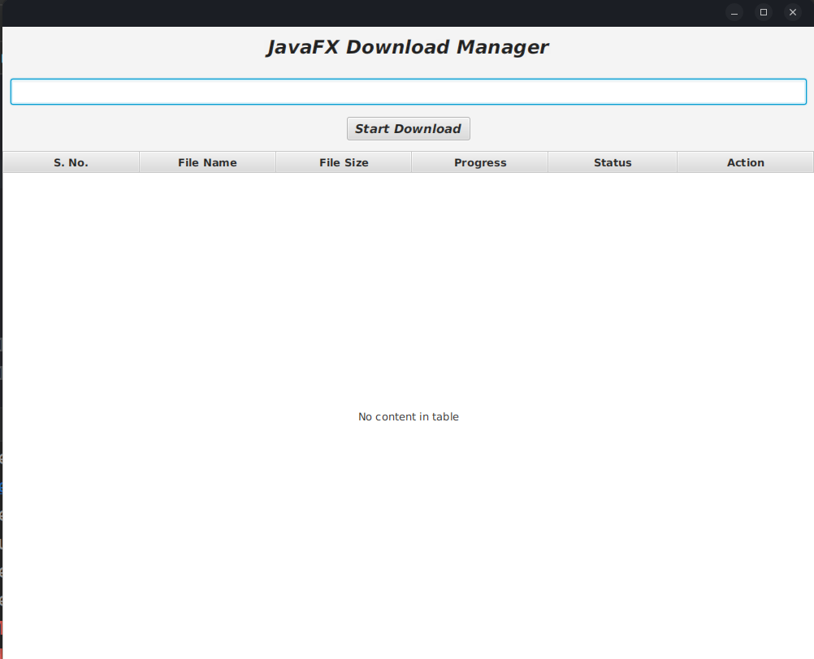
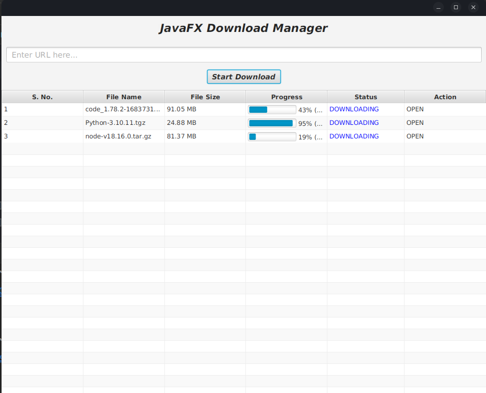

# JavaFx Download Manager

[JavaFX](https://www.google.com/url?sa=t&rct=j&q=&esrc=s&source=web&cd=&cad=rja&uact=8&ved=2ahUKEwjWiPr7y_z-AhWGcGwGHTCXDoQQFnoECA4QAQ&url=https%3A%2F%2Fopenjfx.io%2F&usg=AOvVaw2P5dkXLo34-ktNP6qMX847) is an open source, next generation client application platform for desktop, mobile and embedded systems built on Java.

Using the concepts of multi-threading in Java and client application platform JavaFX, this application is created. 
## Features

- Download file through url
- Can download several files together using the concept of multi-threading in Java

## Screenshots

